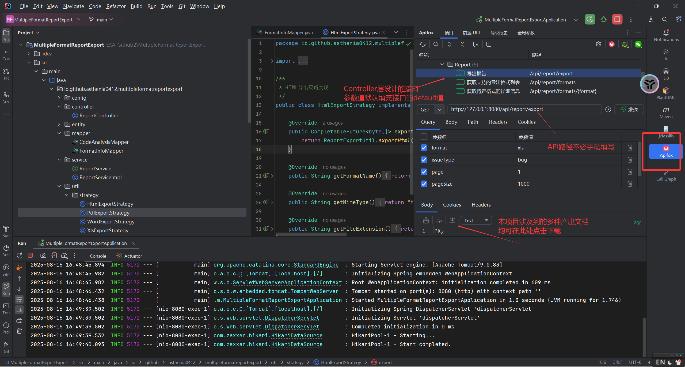

# 多格式报告导出系统

一个基于Spring Boot2的多格式报告导出系统，支持Excel、Word、PDF、HTML、XML等多种格式的代码质量分析报告导出。

## 关于调试

推荐在IDEA内使用APIFOX插件，在项目启动后，可通过插件在IDEA中完成对接口的调试工作



## 功能特性

-  **多格式支持**: 支持XLS、XLSX、DOCX、PDF、HTML、XML等多种导出格式
-  **策略模式**: 使用策略模式实现不同格式的导出逻辑
-  **数据管理**: 支持代码分析数据的增删改查和分页查询
-  **配置灵活**: 支持格式信息的动态配置和管理
-  **异步处理**: 使用CompletableFuture实现异步导出，提升性能

## 技术架构

### 核心组件

- **ExportStrategy**: 导出策略接口，定义统一的导出方法
- **ExportStrategyFactory**: 策略工厂，根据格式类型创建对应的导出策略
- **ReportGenerator**: 报告生成器，负责具体格式的生成逻辑
- **Service层**: 业务逻辑层，集成策略和生成器
- **Controller层**: 控制器层，提供REST API接口

### 支持的导出格式

| 格式 | 扩展名 | MIME类型 | 状态 |
|------|--------|----------|------|
| Excel | .xls/.xlsx | application/vnd.ms-excel | 支持 |
| Word | .docx | application/vnd.openxmlformats-officedocument.wordprocessingml.document | 支持 |
| PDF | .pdf | application/pdf | 支持 |
| HTML | .html | text/html | 支持 |
| XML | .xml | application/xml | 支持 |

## 数据库设计

### 表结构

#### format_info (格式信息表)
```sql
CREATE TABLE format_info (
    id INT AUTO_INCREMENT PRIMARY KEY,
    format_name VARCHAR(50) NOT NULL UNIQUE,
    description TEXT,
    mime_type VARCHAR(100),
    file_extension VARCHAR(20),
    supported BOOLEAN DEFAULT TRUE,
    features JSON,
    created_time TIMESTAMP DEFAULT CURRENT_TIMESTAMP,
    updated_time TIMESTAMP DEFAULT CURRENT_TIMESTAMP ON UPDATE CURRENT_TIMESTAMP
);
```

#### code_analysis (代码分析表)
```sql
CREATE TABLE code_analysis (
    id INT AUTO_INCREMENT PRIMARY KEY,
    issue_type VARCHAR(50) NOT NULL,
    severity VARCHAR(20) NOT NULL,
    description TEXT,
    line_number INT,
    file_path VARCHAR(255),
    created_time TIMESTAMP DEFAULT CURRENT_TIMESTAMP
);
```

## API接口

### 导出报告
```
GET /api/report/export?format={format}&issueType={issueType}&page={page}&pageSize={pageSize}
```

### 获取支持的格式
```
GET /api/report/formats
```

### 获取格式详情
```
GET /api/report/formats/{format}
```

### 获取数据统计
```
GET /api/report/count
```

### 获取分页数据
```
GET /api/report/data?issueType={issueType}&page={page}&pageSize={pageSize}
```

## 使用示例

### 1. 导出Excel报告
```bash
curl "http://localhost:8080/api/report/export?format=xls&issueType=bug&page=1&pageSize=100"
```

### 2. 导出Word报告
```bash
curl "http://localhost:8080/api/report/export?format=docx&issueType=code_smell&page=1&pageSize=50"
```

### 3. 导出PDF报告
```bash
curl "http://localhost:8080/api/report/export?format=pdf&issueType=vulnerability&page=1&pageSize=200"
```

## 配置说明

### application.properties
```properties
# 数据库配置
spring.datasource.url=jdbc:mysql://localhost:3306/test_report
spring.datasource.username=your_username
spring.datasource.password=your_password

# MyBatis配置
mybatis.mapper-locations=classpath:mapper/*.xml
mybatis.type-aliases-package=io.github.asthenia0412.multipleformatreportexport.entity
```

## 部署说明

### 环境要求
- Java 8+
- MySQL 5.7+
- Maven 3.6+

### 构建和运行
```bash
# 克隆项目
git clone https://github.com/your-repo/MultipleFormatReportExport.git

# 进入项目目录
cd MultipleFormatReportExport

# 构建项目
mvn clean package

# 运行项目
java -jar target/multiple-format-report-export-0.0.1-SNAPSHOT.jar
```
